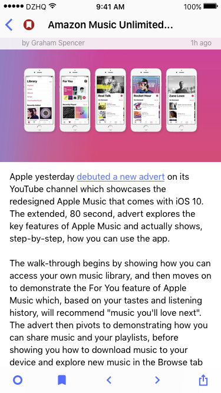
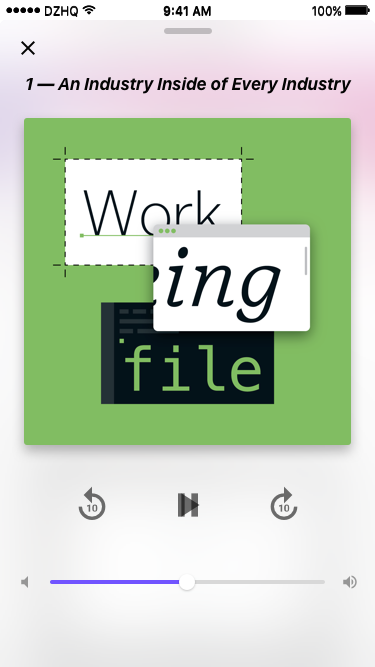
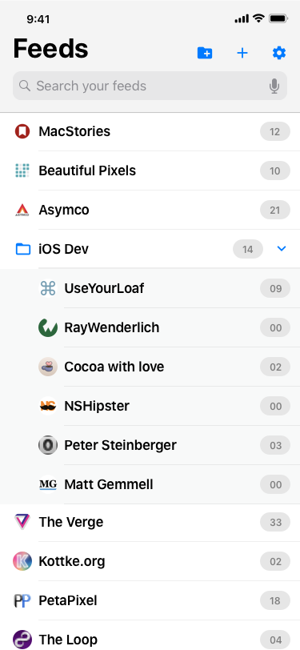
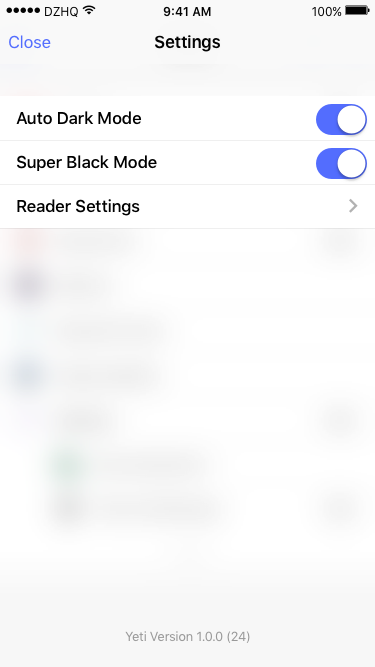
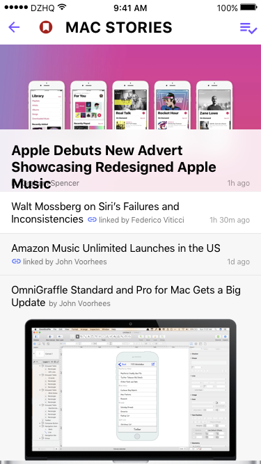
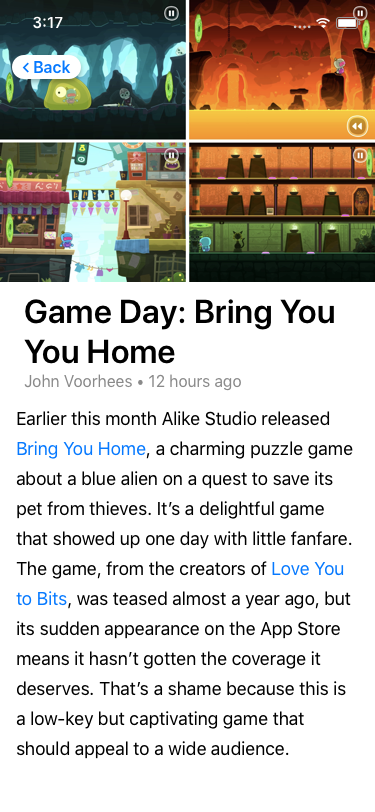

# Artboards

This is an autogenerated file showing all the artboards. Do not edit it directly.

## Alert

## Article - Standard

## Article Components 375w

## Article Components

## Article Inline Images

## Article Word only

## Article

## Background Bar

## Bars

## Bottom Bar

## Cell

## Cell Elements

## Dark:Article Inline Images

## Dark:Article Word only

## Dark:Article

## Dark:Enclosure

## Dark:Home

## Dark:Settings

## Dark:Setup

## Dark:Website

## Elements

## Enclosure

## Feed

## Feeds

## Keyboard

## Misc 

## Modal

## Navigation Bar

## Overrides

## Reader Settings

## Reader Settings

## Reader-Toolbar-Dark

## Reader-Toolbar

## Settings > Reader

## Settings

## Setup

## Status Bar

## Status Bar 

## Text Fields 

## Toolbar Buttons 

## Website

## YTNavBar

## _

## backbutton

## feed

## feeds

## iPad Pro Landscape

## t

